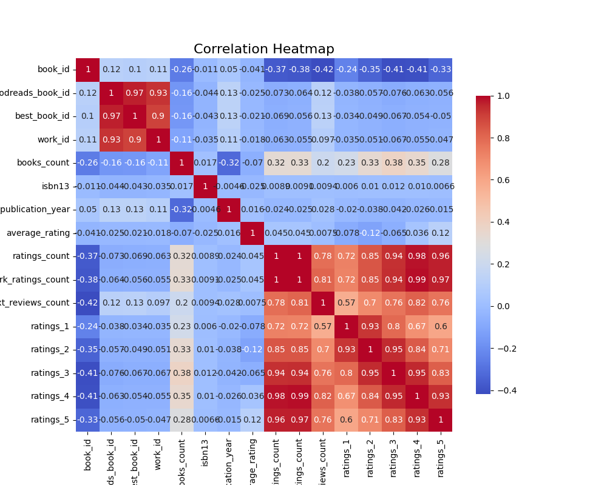
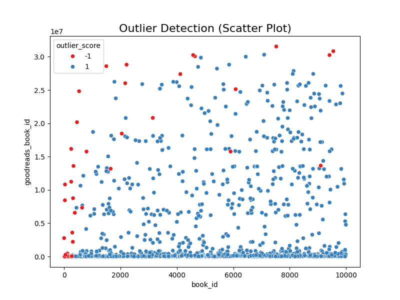
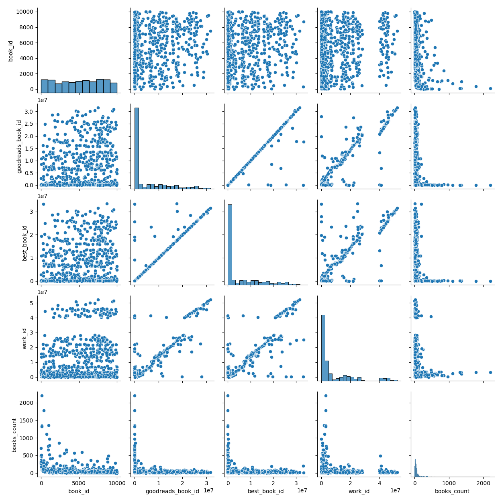

# Dataset Summary and Analysis Report

## Dataset Overview
- **Number of Records**: 10,000
- **Number of Columns**: 23
- **Key Identifiers**: 
  - `book_id`, `goodreads_book_id`, `best_book_id`, `work_id`

## Missing Values
The dataset contains missing values in several columns:
- `isbn`: 700 missing entries
- `isbn13`: 585 missing entries
- `original_publication_year`: 21 missing entries
- `original_title`: 585 missing entries
- `language_code`: 1,084 missing entries

Columns such as `authors`, `average_rating`, and several rating count columns do not have any missing values.

## Author Diversity
The dataset includes **4,664 unique authors**, indicating a broad diversity. The most frequent author, **Stephen King**, appears **60 times**.

## Publication Year Distribution
- **Mean Original Publication Year**: ~1982
- **Minimum Year**: -1750 (suggests potential data entry inaccuracies)
- The 25th percentile is 1990, and the 75th percentile is 2011.

## Language Codes
There are **25 unique language codes**, with a predominance of English titles (`language_code` of 'eng' accounting for **6,341 entries**). The missing values may impact analyses for non-English books.

## Rating and Review Statistics
- **Average Rating**: ~4.00, with a standard deviation of 0.25, suggesting that most books are rated positively.
- The distribution of ratings reveals high skewness towards higher ratings, particularly for ratings of 4 and 5 stars.

## Statistical Imbalance
Features related to ratings exhibit high skewness, especially for `ratings_1`, `ratings_2`, and `ratings_3`, indicating that very few books receive lower ratings. High variance in rating counts suggests that a small number of books dominate the dataset.

## Key Findings
1. **Dataset Structure**: The diverse range of authors and the quality of books indicated by high average ratings.
2. **Missing Values**: Several columns require attention for missingness, particularly in identifiers and publication data.
3. **Outlier Detection**: Negative years in publication data indicate potential data entry errors requiring cleaning.
4. **Rating Distribution**: Books are predominantly highly rated, reflecting positively on the aggregate quality of the dataset.

## Implications
- **Data Cleaning**: Addressing missing values and outliers is crucial for ensuring the dataset's reliability and usability.
- **Enhanced Analysis**: Implementing techniques such as transformations to adjust skewed distributions could lead to more accurate analyses.
- **Feature Engineering**: Adding derived features may provide deeper insights and enhance the potential for predictive modeling.

## Suggestions for Improvement
- **Handle Missing Values**: Impute missing data using median for numerical fields and mode for categorical fields.
- **Data Verification**: Clean erroneous entries like negative publication years.
- **Skewness Handling**: Normalize heavily skewed distributions.
- **Explore Author Contributions**: Group authors by genres to assess impact and trends within the dataset.
- **Visualizations**: Utilize charts and graphs to summarize trends in ratings, authorship, and publication dates.

## Special Analyses
- **Time Series Analysis**: No time-series features detected.
- **Geographic Analysis**: No geographic features detected.
- **Network Analysis**: No network features detected.
- **Cluster Analysis**: Feasible using available numeric features to identify natural groupings.

## Visualizations Generated
- correlation_heatmap.png
- outlier_detection.png
- pairplot_analysis.png

By implementing these suggestions and utilizing the insights derived from the analysis, the dataset can improve its potential for detailed literary analysis and reader engagement strategies.

