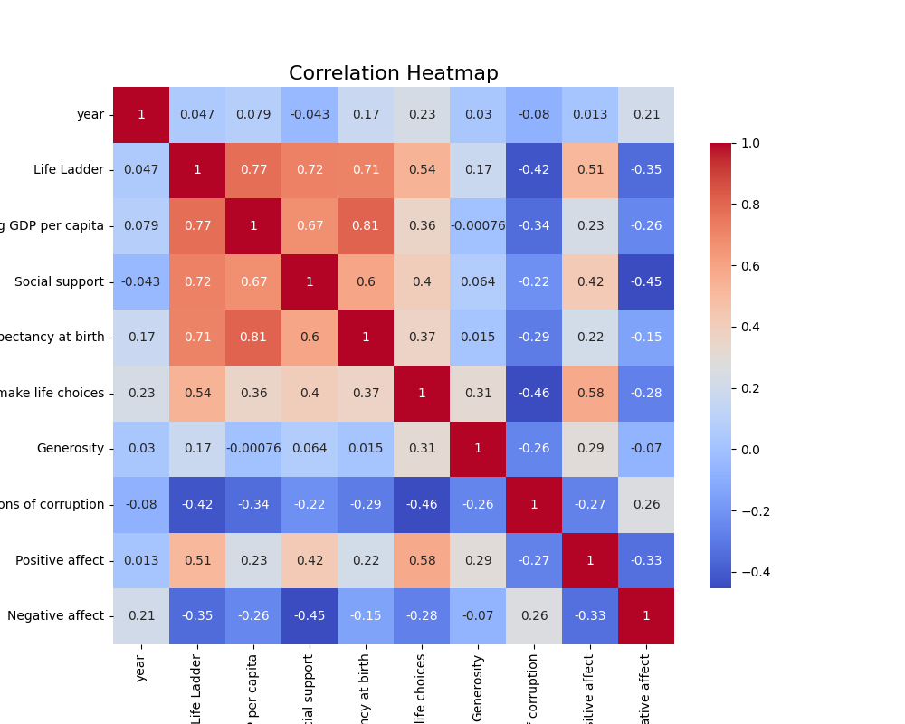
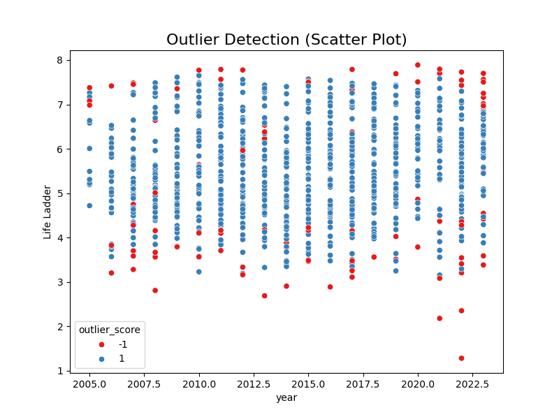
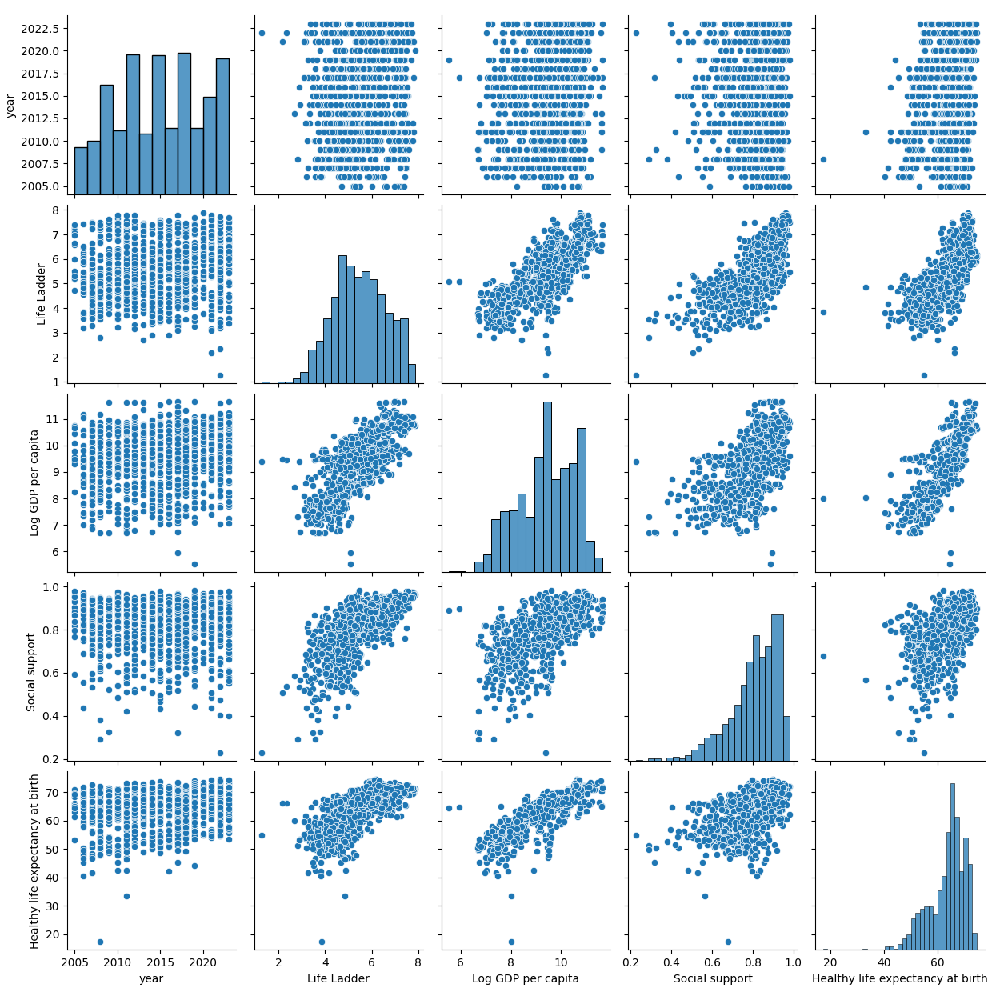

# Summary of the Dataset

## Overview
The dataset comprises 2363 rows and 11 columns, capturing various happiness indicators and social metrics across different countries from 2005 to 2023. The columns include:
- **Country name**
- **Year**
- **Life Ladder**
- **Log GDP per capita**
- **Social support**
- **Healthy life expectancy at birth**
- **Freedom to make life choices**
- **Generosity**
- **Perceptions of corruption**
- **Positive affect**
- **Negative affect**

## Key Insights

### Missing Values:
- There are significant missing values in multiple columns:
  - **Log GDP per capita**: 28 missing values
  - **Social support**: 13 missing values
  - **Healthy life expectancy at birth**: 63 missing values
  - **Freedom to make life choices**: 36 missing values
  - **Generosity**: 81 missing values
  - **Perceptions of corruption**: 125 missing values
  - **Positive affect**: 24 missing values
  - **Negative affect**: 16 missing values

Addressing these missing values is crucial through techniques such as imputation or case exclusion, depending on future analysis objectives.

### Statistical Summary:
- The average "Life Ladder" score is about **5.48**, indicating a moderate reported happiness level.
- The mean "Log GDP per capita" is around **9.40**, with a range from approximately **5.53 to 11.68**, showcasing economic variability among countries.
- The average "Social support" score is **0.81**, reflecting relatively strong perceived social support.
- The "Generosity" metric presents a low mean (close to zero) and a significant negative range, suggesting varying levels of community support and socioeconomic disparities.

### Correlations:
There may be anticipated correlations between these variables, particularly where higher GDP per capita is likely to correlate positively with happiness levels (Life Ladder). Further correlation analysis could provide deeper insights into relationships among these metrics.

### Temporal Distribution:
The dataset encompasses nearly two decades, with an average year of about **2015**. Analyzing changes in metrics over time could reveal trends in well-being relative to economic and social changes.

### Country Representation:
With **165 unique countries** represented, Argentina is the most frequently listed country. Analyzing country-specific data can yield meaningful insights and help identify outliers.

## Suggestions for Improvement:
1. **Missing Value Handling**: Utilize advanced imputation strategies (e.g., k-nearest neighbors, regression imputation) for key metrics.
2. **Normalization of Data**: Scale certain metrics (like GDP per capita) for improved comparative analysis and predictive model performance.
3. **Temporal Analysis**: Conduct time series analysis to track trends over the years, helping to understand shifts in public sentiment and well-being.
4. **Exploratory Data Analysis (EDA)**: Engage in thorough EDA, including visualizations (e.g., histograms, box plots) to comprehend the distribution of metrics and identify outliers.
5. **Multivariate Analysis**: Implement multivariate regression or machine learning models to robustly evaluate the impact of different factors on happiness scores.
6. **Categorical Analysis**: Investigate potential categorical variables (e.g., regions, income levels) to provide additional context to findings.
7. **Enhanced Documentation**: Prepare detailed metadata to elucidate measure definitions, improving accessibility for interpretation and further research.

## Special Analyses:
- **Time Series Analysis**: No time-series features detected.
- **Geographic Analysis**: No geographic features detected.
- **Network Analysis**: No network features detected.
- **Cluster Analysis**: Possible due to the available numerical features, aiding in identifying natural groupings in the data.

## Visualizations:
The following visualizations were generated to support the analysis:
- Correlation Heatmap
- Outlier Detection
- Pairplot Analysis

By addressing the outlined areas, the insights derived from this dataset can be significantly enhanced, leading to a richer understanding of the factors impacting happiness and well-being across various nations.

