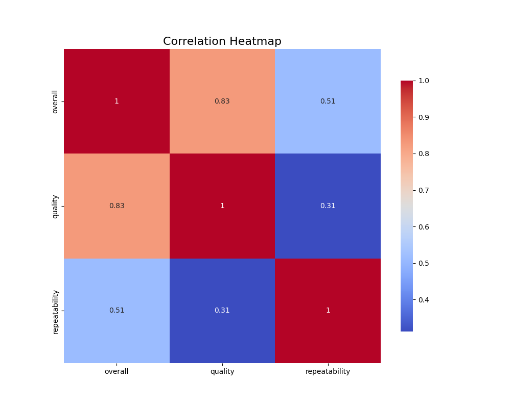
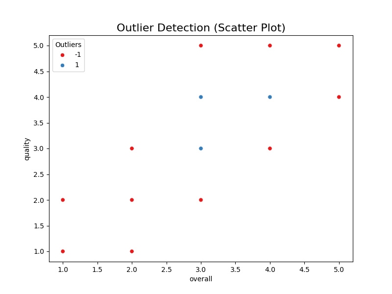
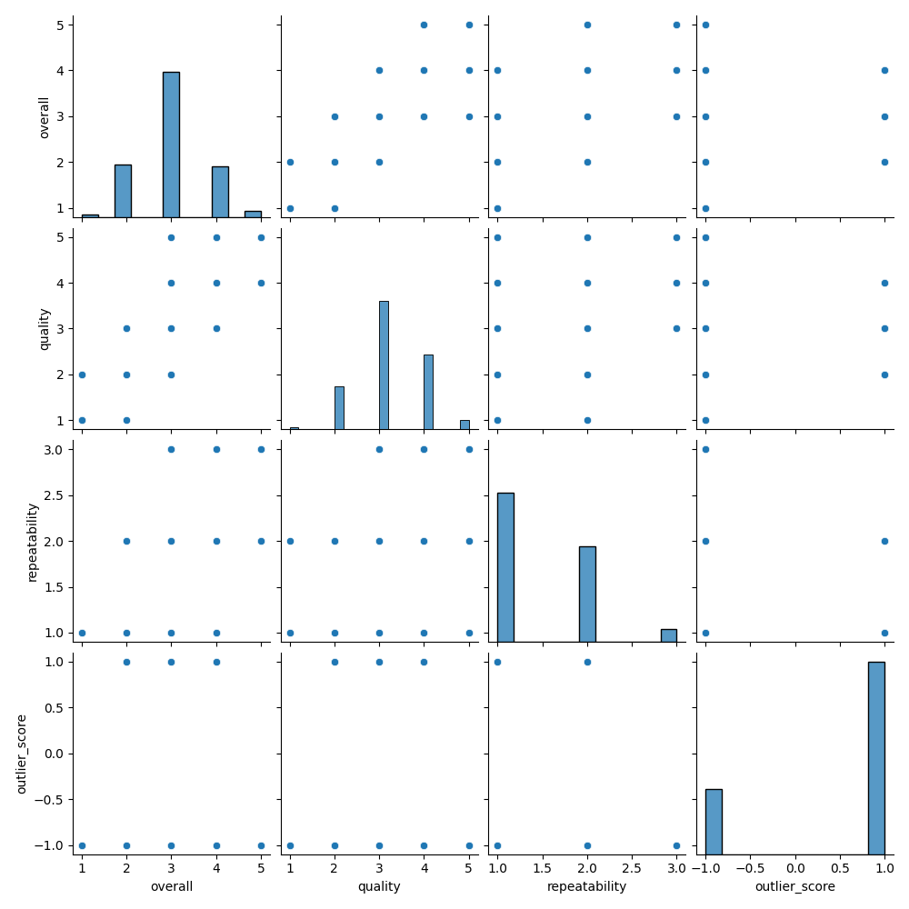

# Dataset Summary and Analysis

## Dataset Overview

- **Size and Structure**: The dataset contains **2652 entries** across **8 columns**, featuring a mix of categorical and numerical attributes.
- **Columns**:
  - **date**: (Object) The date associated with the entry.
  - **language**: (Object) Language of the entry.
  - **type**: (Object) The type of media, primarily movies.
  - **title**: (Object) Title of the entry.
  - **by**: (Object) Contributor or creator of the entry.
  - **overall**: (int64) Overall rating (1 to 5).
  - **quality**: (int64) Quality rating (1 to 5).
  - **repeatability**: (int64) Repeatability score (1 to 3).

## Missing Values

- The dataset exhibits missing values, most notably:
  - **date**: 99 missing values (~3.7%).
  - **by**: 262 missing values (~9.9%).
- Other columns have no missing values, ensuring robust data integrity for analysis.

## Distribution of Attributes

- **Language**: 
  - 11 unique languages, with **English** being predominant (1306 entries).
  
- **Type**: 
  - Mostly **movies** (2211 occurrences).
  
- **Title**: 
  - Contains **2312 unique titles**, with **Kanda Naal Mudhal** noted most frequently (9 occurrences).
  
- **Contributors**: 
  - A diverse contributor pool with **1528 unique entries**, with **Kiefer Sutherland** being the most cited (48 occurrences).

## Statistical Summary for Ratings

- **Overall Rating**:
  - Mean: 3.05 (SD = 0.76); Range: 1 to 5.
  
- **Quality Rating**:
  - Mean: 3.21 (SD = 0.80); Range: 1 to 5.
  
- **Repeatability**:
  - Mean: 1.49 (SD = 0.60); Range: 1 to 3.

This indicates a generally favorable evaluation, particularly in the overall and quality scores, which are skewed towards the higher ratings.

## Variance and Skewness

- Variance for `overall` and `quality` ratings suggests moderate variability, however, the `repeatability` scores have a higher skewness (0.78), indicating lower prevalence of higher scores.

## Key Findings

1. The dataset reflects the prominence of English-language movies and a significant number of missing contributor names, which could influence analysis.
2. Generally high ratings suggest positive reception of overall quality, despite the low repeatability scores, which warrant further investigation.
  
## Implications

1. The presence of missing values necessitates careful consideration before analysis, possibly through imputation strategies.
2. Further analysis of language and contributor impacts on ratings could yield insights beneficial for understanding audience preferences.
3. Regular dataset updates will ensure scalability and continuous relevance, versioning changes in contributors and media.

## Suggestions for Improvement

1. **Address Missing Values**: Implement strategies for handling missing data in the `date` and `by` columns, possibly using imputation or placeholder strategies.
   
2. **Feature Enhancement**: Investigate potential additional attributes that could provide richer insights, such as genre or release year.

3. **Data Visualization**: Utilize visual representations of the rating distributions and relationships among scores to enhance interpretability.

4. **Language and Contributor Analysis**: Identify trends related to language and contributors to better understand their influence on ratings.

5. **Ongoing Data Updates**: Establish processes for continuously updating the dataset to capture evolving trends in movie releases and contributions.

## Special Analyses Conducted

- **Cluster Analysis**: Explored potential groupings in the data using numerical features.
- **Visualizations Created**: Included correlation heatmaps, outlier detection plots, and pair plot analyses to identify relationships and patterns within the dataset. 

This analysis highlights the dataset's insights and potential for future studies, indicating opportunities for deeper inquiry into the factors influencing media evaluations.

